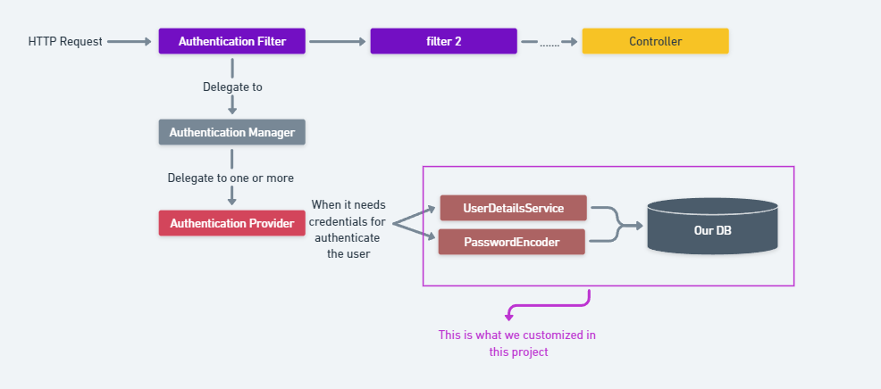

# spring-security
Deeping dive in spring security with spring boot
## What we are building in this project ?
**in this proejct i customized a specific part of the spring-security system as shown in the following diagram:**

I will provide the `authentication-provider` to consume the authentication credentials from my application database instead of generating a random password from spring-security framework and this will be done via implementing the `UserDetailsService` and `PasswordEncoder`.
